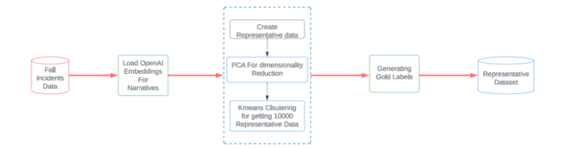
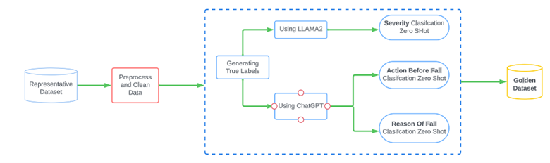
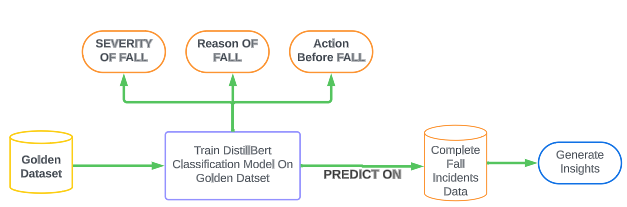

# Table of contents
* [Introduction](#introduction)
* [Data Sampling Strategy](#data_prep)
* [Code Execution](#code_execution)
* [Flow Diagram](#flow)
* [System Specifications](#machine_specs)

# Unsupervised Fall Narrative

## Introduction 
The approach consists of a two-step methodology to effectively work with the primary data. As a part of our first step, we leveraged Large Language Models (LLMs) to extract the hidden information in the narrative and not directly available in the data. Subsequently, `LlaMA2` and OpenAI’s `GPT-3.5` are employed for zero-shot classification to extract important information such as the severity of fall, action performed just before fall, and risk factors associated/reason for the fall from the ED visit narrative texts. The reliability of this gold dataset is confirmed through manual validation and extensive Exploratory Data Analysis (EDA).
 
Then in the second step, a DistilBERT model was fine-tuned using the golden dataset to classify severity, action before fall, and reason for fall. This fine-tuned model was then applied to predict classification labels for the complete primary dataset thereby generating the insights.

## Data Sampling Strategy 
 A distinctive feature of our data sampling approach was a novel strategy, wherein the data was segmented into 10,000 diverse clusters. To ensure maximum diversity in the sample dataset, the data point closest to each cluster's centroid was selected. This approach was designed to capture the essence of the original dataset. It was observed that the sampled data followed similar distribution to that of the actual primary data. This was supported by the data analysis performed on the sample data as well as the actual data. Thorough data analysis validated the reliability of the data sampling strategy, affirming the consistency between insights derived from the sample and the actual dataset.

## Code Execution 
This section explains the steps required to execute the code cells given in the repository. **Primary_data_mapped_cleaned.csv** was used as the input for the step 1. _An OpenAI API key would be required to get inference from GPT3.5-Turbo model (OpenAI). A free version of Google Colab notebook would be sufficient to run the rest of the code files_.

* Install the packages listed in the requirements.txt file (`pip install -r requirements.txt`)
* Install required spacy models with `python -m spacy download en_core_web_sm`
*  **Step 1** : The narratives present in the file `data/medical_terms_mapping.json` were processed through a pre-processing pipeline. The results for this pipeline were stored in the file `data/cleaned_narrative_primary_data.csv`.
* **Step 2**: OpenAI embeddings were loaded and PCA was used for dimensionality reduction which chunked the high-dimensional data (1536) to a relatively lower dimensional data (200). This was followed by a clustering approach using K-Means to generate the sample data. In the clustering approach, 10,000 clusters were formed and the centroid from each cluster was choosen to form our sample data. This data was the reresentative sample of the primary data which was passed through LLMs to extract the hidden details. The data can be found at `data/sample_data_10k.csv`.
* **Step 3**: `LlaMA2` and `OpenAI’s GPT-3.5` were employed for zero-shot classification to extract important information such as the severity of fall, action performed just before fall, and risk factors associated/reason for the fall from the ED visit narrative texts. The respective results for each attribute are available at `data/severity_data_10k.csv`, `data/reason_of_fall_data_10k.csv`, `data/action_before_fall_data_10k.csv` hereby referred to as the golden data.
* **Step 4**: A DistilBERT model was fine-tuned using the golden dataset to classify severity, action before fall, and reason for fall. This fine-tuned model was then applied to predict classification labels for the complete primary dataset thereby enabling us to generate insights. Model checkpoints can be found at mentioned paths - 
    - `Severity` : data/models/checkpoint-20000/
    - `Action before fall` : data/models/checkpoint-10000/
    - `Reason of fall`: data/models/checkpoint-19000/

After getting predictions from the fine-tuned DistilBert model, the final output data was stored at `data/final_combined_data.csv`.

## Flow Diagram 
**Representative Data Creation using Cluster Segmentation**: The main idea behind generating clusters was to maximize the diversity between the falls incident data such that the sample data is representative of the primary data. The data was partitioned in 10,000 clusters which is equal to the sample size of the representative dataset. In order to increase the diversity, the data point closest to the centroid of each cluster was chosen and added to the sample dataset hence making the sample data as diverse as possible.

**Creation of Gold Standard Data using representative data**: Various Large language models (LLMs) were employed to generate gold standard data (training data) for fine-tuning the classification model

**Predictions of Severity, Reason of fall & Action before fall on the Complete Dataset**: The gold data created above was used to fine-tune a DistilBERT model (for classification), which was then used to generate predictions on the complete primary data.

## System Specifications 
The machine specifications and time used to run the model -
* CPU (model): Intel(R) Xeon(R), 2.30GHz, 2 Core
* GPU (model or N/A): 16GB Tesla T4 GPU
* Memory (GB): 78.2 GB
* OS: Windows and Linux
* Train duration: ~4.5 hours
* Inference duration: ~25 hours (inference from LLMs for different attributes, Eg: severity, reason of fall, etc)
